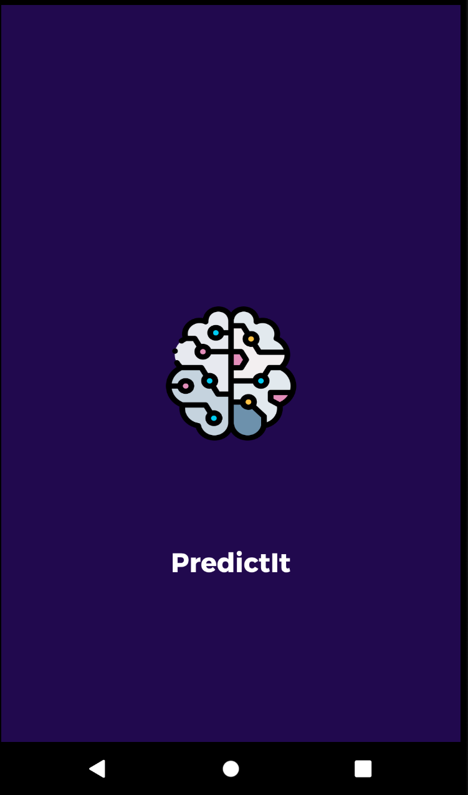
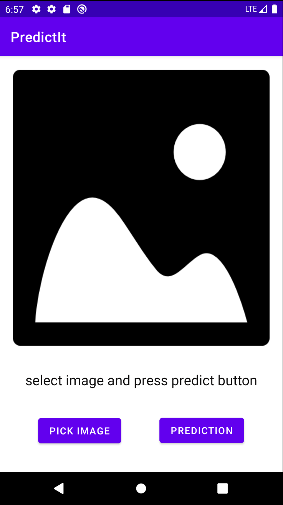
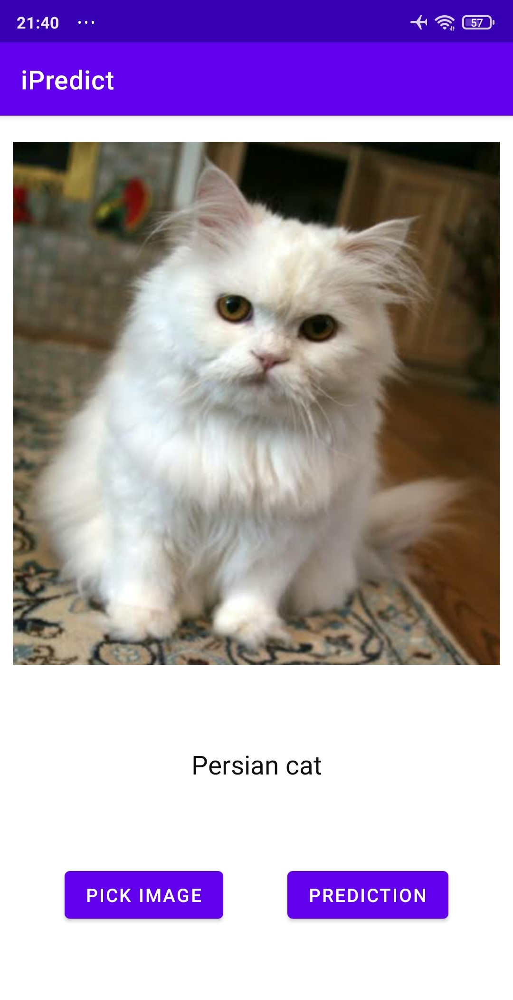
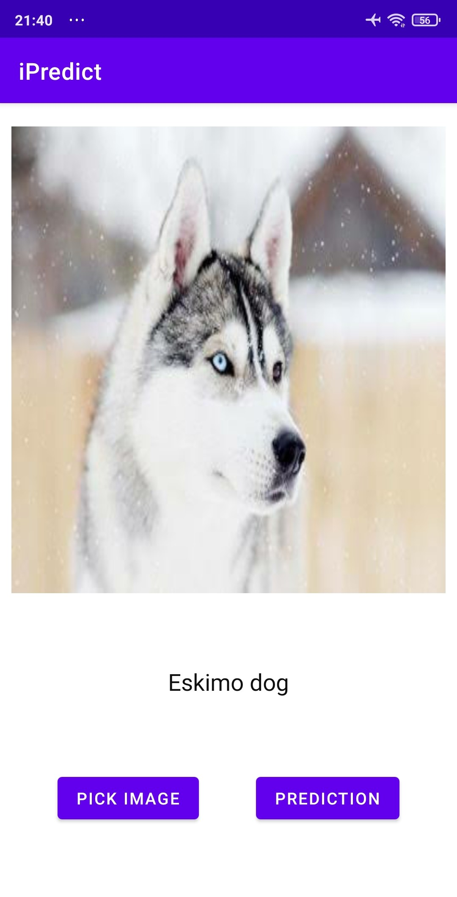

# PredictIt
PredictIt is application that implement Image classification using TensorflowLite
## Specs & Open-source libraries
- Minimum SDK 16
- 100% Kotlin based
- [TensorflowLite](https://github.com/tensorflow/tensorflow/blob/master/tensorflow/lite/g3doc/guide/android.md) tools that enables on-device machine learning to run models on mobile apps.

## Documentation

### State and Activity
|Splash                 |   Blank State             |   Predict Cat         |   Predict Dog     |
|:------------------:|:----------------------------:|:---------------------:|:-----------------:|
|  |  |  |  |
